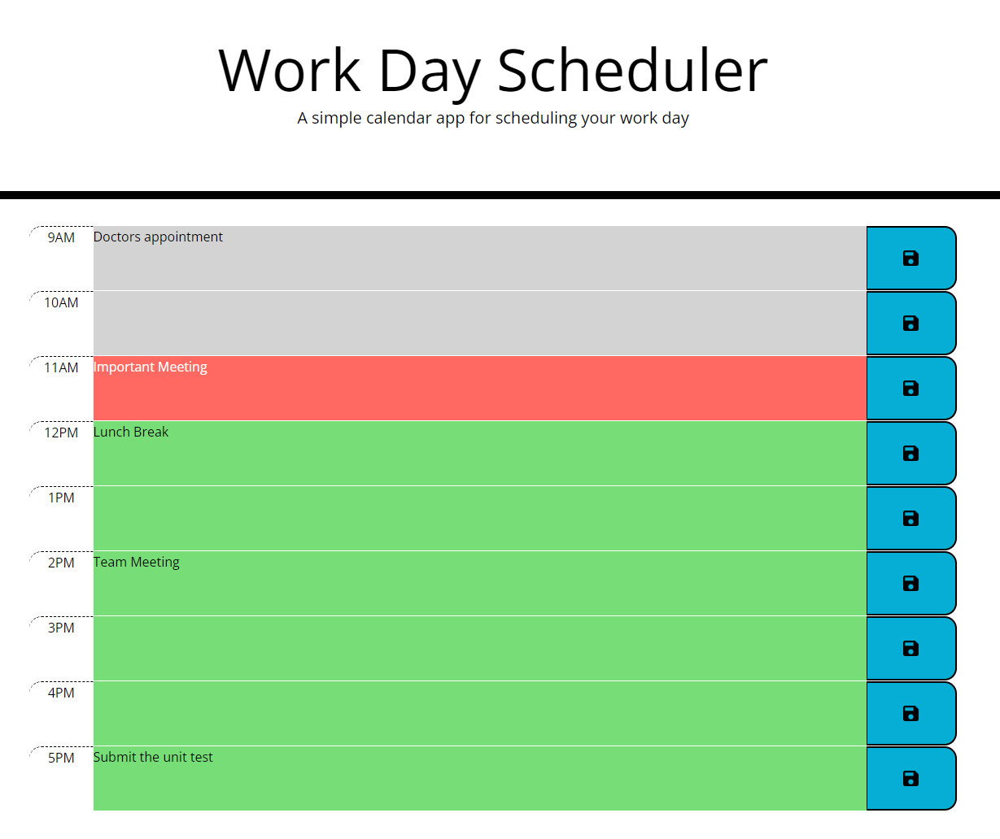

# Day Work Calendar

## Description
I wanted to use JQuery and Bootstrap to create a website that allows for updating information from user input and saving it for later. After Javascript I started looking at JQuery for Javascript and Bootstrap for CSS for my first foray into third party APIs. This webpage allows the user to create a dayplanner and so they know what is happening now, previously and the future of the day. The user does not need to keep the app open to continue seeing their day planner. They can visit the webpage at anytime and get their planner with all saved activities. I was able to apply document navigation skills that I had learned in class that really solidifies that learning from class. 

## Installation
N/A

## Usage
Select the box on the right of the time to enter your arrangement. Click the button with the black floppy disk on the right of the box you entered the information into to save the work.

## Credits
N/A

## License
Public Domain - free use